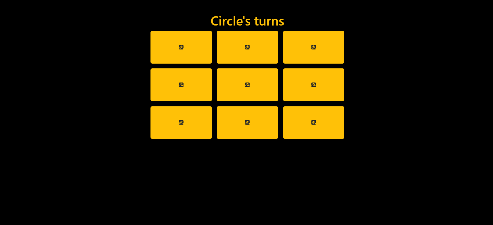

# Creating a TIC TAC TOE React App

This is a project which I created for practice purposes.
-- It's a tic tac toe game of two players
- implemented toasts
- brought in Icons

Time Taken
- 1 hour

What I learnt in this project
- States 
- Props

Deployed on Netlify
[**Netlify Link**](https://tic-tac-toe-react-yo.netlify.app/)